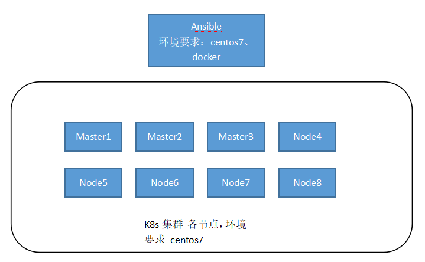

## 快速安装一个k8s集群
### 要求
* 安装节点有docker 运行环境 
* k8s集群master和node节点操作系统为centos7





### 简介
镜像地址 registry.cn-hangzhou.aliyuncs.com/chenhuazhong/localkube  
该项目验证通过 k8s v1.20.7版本安装，网络插件为 flannel  
已把安装过程中需要下载的kubeadm、kubectl、kubelet等文件保存到镜像中。安装过程中需要的其他容器镜像已经上传到阿里云  
该项目是基于 开源项目 kubespray改造。只用与学习目的快速搭建k8s集群。搭建生产可用集群请参考原项目。


### 安装步骤
- 拉取镜像
```commandline
docker pull registry.cn-hangzhou.aliyuncs.com/chenhuazhong/localkube:v1
```
- 启动容器
```commandline
docker run -it  registry.cn-hangzhou.aliyuncs.com/chenhuazhong/localkube:v1 bash
```
- 编辑主机清单
```commandline
vim ./inventory/sample/inventory.ini
```
- 初始化各个节点
```commandline
ansible-playbook -i inventory/sample/inventory.ini initlinux.yaml
```
- 安装k8s集群
```commandline
ansible-playbook -i inventory/sample/inventory.ini cluster.yml
```

